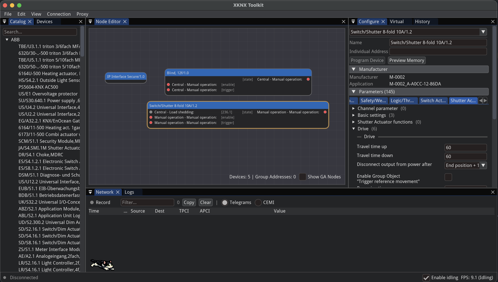

# XKNX Toolkit

> [!WARNING]
> **Alpha, experimental software.** XKNX Toolkit is not intended for end users and comes with no stability or safety guarantees — expect breaking changes, rough edges, and bugs. It's mostly useful for developers experimenting with the [xknx](https://github.com/XKNX/xknx) library. It cannot program devices, and no support is offered to end users. Contributions are welcome. Large parts of this project were built using LLMs.

XKNX Toolkit is a desktop application and set of Python libraries for working with [KNX](https://www.knx.org/) home and building automation installations — browsing product catalogs, editing installation projects, and talking to real or simulated KNX devices.



## Features

### Node-based project editor

Devices and group addresses are laid out as nodes on a canvas. Communication objects are linked to group addresses by drawing a connection between them, with live datapoint-type (DPT) compatibility checks and warnings for lossy or ambiguous links. Every change (device edits, links, renames, address moves) is tracked in a full undo/redo history.

### Project management

Devices are organized by area/line/segment, matching standard KNX topology. Each device's parameters, com object flags, load procedures, and raw memory layout can be inspected and edited directly.

### Product catalog

Import `.knxprod` archives to build up a searchable catalog of manufacturers, hardware, and application programs, independent of any single project. Catalog entries can be dragged into a project as new devices.

### Real KNX connections

Connect to a real KNX interface over tunneling (TCP/UDP) or routing (multicast), with automatic gateway discovery or manual IP entry.

### Virtual devices and proxy — test without hardware

No KNX interface on hand? XKNX Toolkit can stand in for one:

- **Virtual Router** — simulates a KNX line over multicast routing, so other tools can discover and talk to it as if it were a real router.
- **Virtual Devices** — simulate individual KNX devices, including programming-mode scanning and serial-number-based addressing.
- **Proxy** — a minimal KNXnet/IP tunnelling server added manually as an interface, useful for inspecting or relaying traffic between a real connection and another client without a physical interface in the loop.

### Network monitor and logs

Every KNX telegram crossing a connection, the virtual router, or the proxy can be recorded and inspected in the Network panel, alongside a structured, filterable log of what the application itself is doing.

## Installation

Only running from source is supported for now — this is developer-focused software, see below.

## Running from source

```bash
uv sync
uv run python -m knx_gui.main
```

## Packages

The application is built on a set of standalone, typed Python libraries (the `xknxmono` namespace) that can also be used independently of the GUI:

| Package | Import | Description |
|---------|--------|-------------|
| `xknx-models` | `xknxmono.models` | KNX XML schema bindings and version detection (foundation for the rest) |
| `xknx-product` | `xknxmono.product` | Reads and validates `.knxprod` product archives |
| `xknx-catalog` | `xknxmono.catalog` | Product catalog built from imported `.knxprod` archives |
| `xknx-project` | `xknxmono.project` | Project state management for KNX installations |
| `xknx-keyring` | `xknxmono.keyring` | Parses and serializes KNX keyring XML (KNX IP Secure keys) |

```bash
pip install xknx-models xknx-product xknx-catalog xknx-project xknx-keyring
```

## Development

```bash
uv sync                             # Install dependencies
uv run pytest                       # Run all tests
uv run pytest packages/models       # Run tests for a single package
uv run ruff check                   # Lint
uv run ruff format                  # Format
uv run pyright                      # Type check
```

See `CLAUDE.md` and `apps/knx-gui/CLAUDE.md` for architecture notes and repo conventions.

### Developing against a local xknx checkout

To test unreleased `xknx` library changes end-to-end in the GUI, point `apps/knx-gui` at a sibling checkout instead of the published package:

```bash
git clone https://github.com/XKNX/xknx ../xknx   # relative to xknxtoolkit/
```

Add a source override to `apps/knx-gui/pyproject.toml`:

```toml
[tool.uv.sources]
xknx = { path = "../../../xknx", editable = true }
```

Then re-lock:

```bash
uv lock
```

Revert both files (`git checkout apps/knx-gui/pyproject.toml uv.lock`) before committing, to go back to the published version.

## Requirements

- Python >= 3.12
- [uv](https://docs.astral.sh/uv/)
